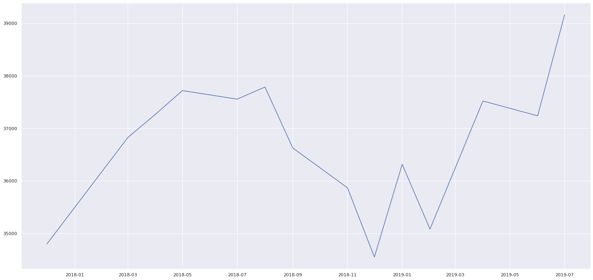
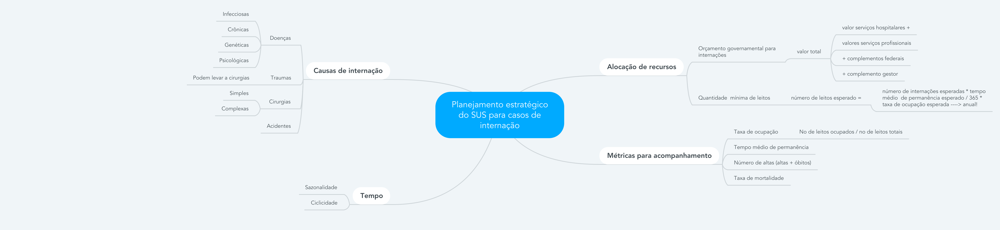
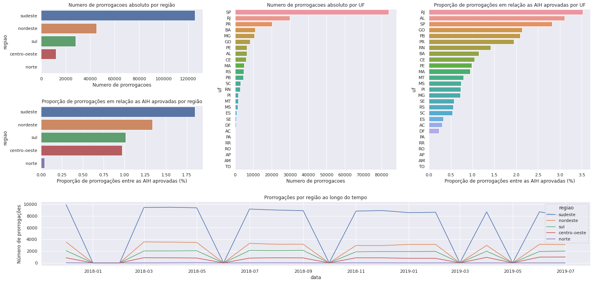
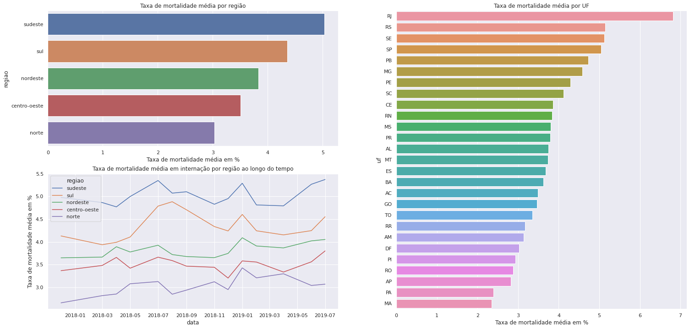
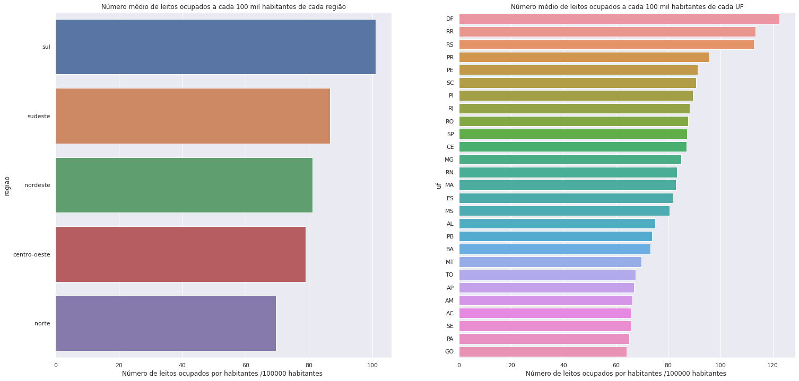

# Análise e previsão de internações do SUS

*Este é um projeto de análise e insights da base de dados de internação do SUS de 2017 a 2019, com uso de séries temporais para previsão de novas internações*

#### Esse projeto foi feito por Lara de Almeida.

# 1. Questão de negócio

 Um hospital é uma das organizações mais complexas operadas pelo homem. Quando trazemos isso para nível Brasil, para os hospitais e instituições credenciadas do SUS, faz-se mais que necessário instrumentos que auxiliem a estruturar a gestão e realizar um planejamento estratégio de maneira eficaz em todos os aspectos como recursos monetários alocados e planejamento de leitos. O SUS também deve prestar serviços de qualidade a população e para isso precisa acompanhar métricas como tempo de permanência e taxa de mortalidade de seus hospitais.

Munida dos dados de Internações Hospitalares do SUS por local de internação de dezembro de 2017 a julho de 2019, o presente projeto visa, após limpeza e transformações do dataset, trazer insights relevantes para o planejamento estratégico dos próximos meses para as unidades hospitalares participantes do SUS.

Além disso, o time de gestores do SUS precisa de uma previsão para os 06 meses subsequentes desse dataset para auxiliá-los nas tomadas de decisão, que vai de agosto de 2019 janeiro de 2020.

 

# 2. Considerações do negócio

Para fins de projeto, não foram trazidos mais dados externos do SUS.

  
# 3. Estratégia de solução

Minha estratégia para resolver esse desafio foi:

**Step 01. Descrição dos dados:** 
A etapa de descrição dos dados é fundamental para entender o comportamento dos mesmos. Mas, antes de seguir com essa etapa, foi necessário realizar uma pré-limpeza dos dados, separando UF e região, renomeando as colunas, removendo caracteres especiais, fazendo umalimpeza e substituição dos dados faltantes e alterando os tipos dos dados para que as análises se tornassem mais convenientes. 
Durante esse processo, foi notado que existiam períodos faltantes (jan, fev, jun e out/2018, mar e mai/2019). A inserção desses períodos com dados faltantes também foi realizada nessa etapa a fim de trazer uma visualização mais completa do dataset.  
Em seguida, com auxílio das funções do pandas, foi feita uma descrição dos dados para obtenção das estatísticas das features. Um plot dos dados de internação pelo tempo também foi feito para avaliação inicial  do comportamento da série. Em uma primeira visualização, não ficaram totalmente claros a existência de tendência, apesar de já ser notada uma certa sazonalidade.

**Step 02. Feature Engineering:**
Feature engineering é a etapa de criar novas features com o objetivo de desenvolver um bom modelo posteriormente. Para essa etapa, foram criadas hipóteses de informações que poderiam ser relevantes para o planejamento estratégico do SUS no aspecto de internações, com um auxílio de um mapa mental. 
Ao todo, foram criadas 14 hipóteses, que mostraram a necessidade de criar features de região, número de leitos ocupados, população por UF (trazida dos dados abertos do IBGE), número de prorrogações, total de complemento federal e total complemento do gestor.

**Step 03. Análise exploratória dos dados (EDA):**
A EDA é uma das etapas mais importantes do modelo. É o momento de extrair insights que sozinhos (sem um modelo de machine learning ) já podem ter valor significativo para o negócio. A estratégia aqui foi fazer uma análise univariada para ter um visual da distribuição das variáveis numéricas e, em seguida, fazer análises bivariadas, isto é, comparando duas features utilizando os filtros e operações do pandas com alguma biblioteca de visualização (aqui usamos pyplot e seaborn). As comparações feitas tiveram como objetivo validar ou refutar as hipóteses geradas na etapa de Feature Engineering.

**Step 05. Preparação dos dados:**
Aqui a principal tarefa foi fazer a imputação dos dados dos períodos faltantes. Foram consideradas várias possibilidades como:
- Substituir NaN pela média ou mediana da série,
- Substituir NaN pelo próximo valor ou pelo valor anterior
- Substituir NaN pela média móvel de valores anteriores
- Criar um modelo preditivo para previsão dos dados faltantes

Considerando que esse é o primeiro ciclo do projeto, optei por utilizar a média móvel, por ser um método simples porém mais completo que a simples substituição pela média dos dados não faltantes. 

**Step 06. Modelagem dos dados:**
Para o modelo de previsão futura, após realizar um teste de estacionariedade de Dickey-Fuller para cada variável e atestar a estacionariedade, escolhi utilizar o Auto ARIMA, modelo ARIMA que gera os valores de p, d e q. Transformei cada uma das variáveis que queria prever (internações, óbitos e valor médio de aih) em séries temporais e os dividi em dados de treino e teste (últimos 06 meses do dataset) para avaliação dos resultados. 

**Step 07. Avaliação e conversão dos dados e do modelo:**
A avaliação dos modelos foi feita comparando os valores previstos com os dados de teste e obtendo o erro absoluto e erro percentual de cada previsão, onde foi possível ver claramente que o erro aumentava conforme o período previsto se distanciava do último período do dataset. 
Por fim, os modelos foram aplicados ao dataset todo para as previsões finais. Com os valores de internações e AIH médio esperados, foi possível estimar o valor total esperado que será gasto em internações nos próximos 06 meses a nível nacional.

# 4. Top 3 Data Insights

**Hipótese 11:**
A região Sudeste deve concentrar o maior número de prorrogaões de internação que os outros estados.

**VERDADEIRA.** A região Sudeste concentra o maior número de prorrogações tanto em valor absoltuo quanto em proporção ao total de AIH aprovadas, com destaque para os estados de São Paulo e Rio de Janeiro. Alagoas é um estado também possui taxas bastante elevadas de prorrogações.

**Hipótese 10:** Ataxa de mortalidade deve ser maior em estados do Norte e Nordesete, respectivamente.

**Falsa.**  taxa de mortalidade é maior em estados do Sudeste e Sul, respectivamente, com destaque para o Rio de Janeiro.
Em agosto de 2018 a taxa de mortalidade de todas as regiões decaiu, exceto para região sul, que aumentou

**Hipótese 06:** A região sudeste é a que deve possuir mais leitos ocupados por habitante

**Falsa.** A região Sul é a que possui mais leitos ocupados por habitante, liderados pelo estado do Paraná. Essa informação pode ser comparada com alguma informação da capacidade para estratégias de aumento ou manutenção de leitos disponíveis

# 5. Modelo aplicado
Como dito anteriormente, foi aplicado um modelo ARIMA para cada uma das três séries temporais (internações, óbitos e valor médio de AIH), cujos parâmetros foram selecionados automaticamente (auto arima)

# 6. Performance do modelo
A performance para número de internações foi:

|       data |        real |   previsto | erro absoluto | erro percentual |
|-----------:|------------:|-----------:|--------------:|----------------:|
| 2019-02-01 |  947202.000 | 915913.000 |    -31289.000 |          -3.303 |
| 2019-03-01 |  957246.000 | 937375.000 |    -19871.000 |          -2.076 |
| 2019-04-01 | 1013065.000 | 895405.000 |   -117660.000 |         -11.614 |
| 2019-05-01 |  968406.500 | 859845.000 |   -108561.500 |         -11.210 |
| 2019-06-01 | 1005416.000 | 907478.000 |    -97938.000 |          -9.741 |
| 2019-07-01 | 1018125.000 | 874184.000 |   -143941.000 |         -14.138 |

A performance para número de óbitos foi:

|       data |      real |  previsto | erro absoluto | erro percentual |
|-----------:|----------:|----------:|--------------:|----------------:|
| 2019-02-01 | 39496.000 | 38157.584 |     -1338.416 |          -3.389 |
| 2019-03-01 | 40751.000 | 39213.857 |     -1537.143 |          -3.772 |
| 2019-04-01 | 41806.000 | 35457.732 |     -6348.268 |         -15.185 |
| 2019-05-01 | 41183.000 | 34659.489 |     -6523.511 |         -15.840 |
| 2019-06-01 | 44477.000 | 39527.658 |     -4949.342 |         -11.128 |
| 2019-07-01 | 46924.000 | 34874.635 |    -12049.365 |         -25.678 |

A performance para valor médio por AIH foi: 

|       data |     real | previsto | erro absoluto | erro percentual |
|-----------:|---------:|---------:|--------------:|----------------:|
| 2019-02-01 | 1136.357 | 1144.799 |         8.442 |           0.743 |
| 2019-03-01 | 1140.126 | 1127.066 |       -13.060 |          -1.146 |
| 2019-04-01 | 1133.459 | 1130.674 |        -2.784 |          -0.246 |
| 2019-05-01 | 1140.122 | 1125.518 |       -14.605 |          -1.281 |
| 2019-06-01 | 1138.843 | 1159.757 |        20.914 |           1.836 |
| 2019-07-01 | 1175.484 | 1152.655 |       -22.829 |          -1.942 |

e as previsoes finais foram:

|    data    | previsao_internacoes | previsao_obitos | previsao_valor_medio_aih |
|:----------:|---------------------:|----------------:|-------------------------:|
| 2019-08-01 |           984831.000 |       42595.079 |                 1169.513 |
| 2019-09-01 |           994875.000 |       43806.697 |                 1177.837 |
| 2019-10-01 |          1050694.000 |       44867.504 |                 1158.857 |
| 2019-11-01 |          1006035.500 |       44243.727 |                 1187.986 |
| 2019-12-01 |          1043045.000 |       47537.831 |                 1182.490 |
| 2020-01-01 |          1055754.000 |        49984.81 |                 1207.192 |

# 7. Resultados de negócio
Assim, com os dados e previsões anteriores, foi possível estimar o valor total que será gasto com internações nos próximos 6 meses a nível nacional

|            | previsao_internacoes | previsao_valor_medio_aih | orcamento_bilhao_R$ |
|-----------:|---------------------:|-------------------------:|--------------------:|
| 2019-08-01 |           984831.000 |                 1169.513 |               1.152 |
| 2019-09-01 |           994875.000 |                 1177.837 |               1.172 |
| 2019-10-01 |          1050694.000 |                 1158.857 |               1.218 |
| 2019-11-01 |          1006035.500 |                 1187.986 |               1.195 |
| 2019-12-01 |          1043045.000 |                 1182.490 |               1.233 |
| 2020-01-01 |          1055754.000 |                 1207.192 |               1.274 |

# 8. Conclusão

Lidar com séries temporais é uma tarefa complexa porém essencial em alguns casos. Porém, nenhum modelo será capaz de prever acontecimentos de alto impacto e difíceis de prever, como é o caso da pandemia de COVID-19, por exemplo. 

Outras abordagens poderiam ser utilizadas para realizar a previsão, tanto de séries temporais, quanto uma abordagem de regressão, trazendo mais features de dados externos, como dados populacionais, econômicos, climáticos etc de cada uma das localidades. 

Como o principal objetivo do primeiro ciclo de projeto é entregar uma solução que já gere valor para o negócio, podemos considerar que essa solução foi satisfatória.

Como é possível perceber, há uma leve tendência de aumento no número de internações nos próximos meses. As internações podem ser causadas por diversas razões e uma estratégia para reduzir esse número é focando na redução de internações 'evitáveis'. O governo deve investir na prevenção de doenças epidemiológicas e promover ações que incentivem hábitos saudáveis de alimentação e exercícios físicos. Investir na saúde básica para que a população tenha acesso a medicina antes que doenças se agravem. Criar programas para que as pessoas envelheçam bem. Também deve desenvolver ações para a diminuição de acidentes, que podem representar uma parcela razoável do número total de internações. 

O Estado de São Paulo é o que representa o maior gasto com internações do país, o que é coerente com a sua população. Além disso, é possível que ele concentre uma porção maior de cirurgias mais complexas que também requerem internação. Com as epecificidades do tipo de cada internação seria possível dar recomendações mais específicas para cada uma das UFs.

# 9. Lições aprendidas
Nesse projeto a principal lição aprendida foram os conceitos de práticas de séries temporais.

# 10. Próximos passos para melhorar

Para próximos passos, consideraria testar outros métodos de imputação de dados, e aplicaria outros modelos de time series. Para aprofundar ainda mais, tentaria trazer dados externos disponibilizados pelo IBGE para criar novas features e tentar aplicar um modelo de regressão para previsão, fazendo um encoding ordinal para as variáveis de data. 

Por fim, para entregar o modelo para o time de negócios / gestores do SUS, criaria um dashboard para consulta dos dados passados e previsões para o futuro, não somente a nível Brasil, mas com filtros para seleção de região e UF. Se tais dados estiverem disponíveis, é possível aprofundar ainda mais, fazendo análises por tipo de internação, o que possibilitaria a elaboração de planos de ação ainda mais assertivos.

# All Rights Reserved - Comunidade DS 2021
